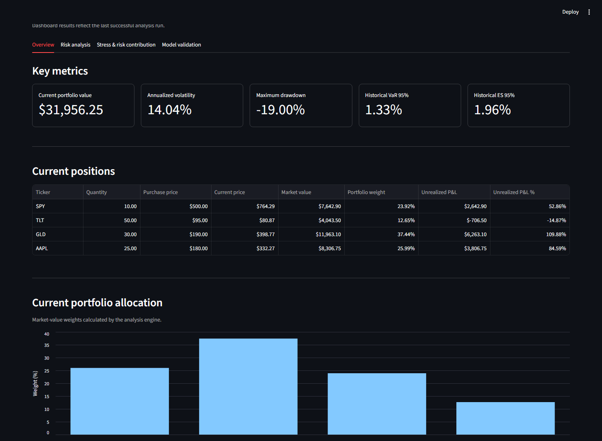
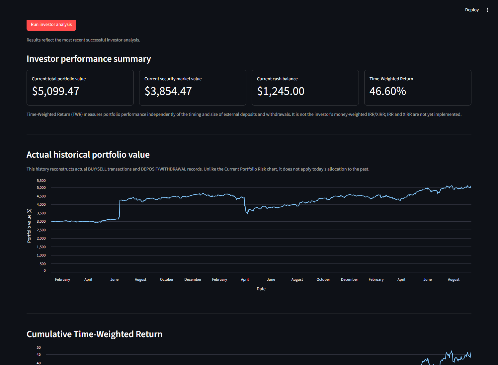
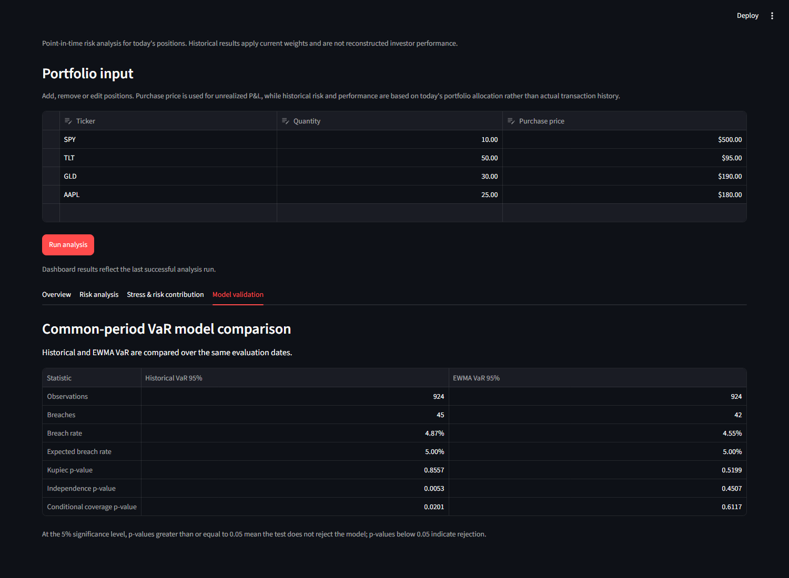

# Portfolio Risk Analytics

Portfolio Risk Analytics is a Python and Streamlit application for exploring portfolio risk and
cash-flow-aware investment performance. It presents two separate workflows: **Current Portfolio
Risk** for today's allocation and **Investor Performance** for an actual transaction history. The
project demonstrates practical market-risk, portfolio-accounting, pandas, and model-validation skills.

## Application preview

**Current Portfolio Risk**



**Investor Performance**



**VaR Model Validation**



## Two analytical workflows

### Current Portfolio Risk

This workflow values today's positions and applies their current market-value weights to historical
asset returns. It reports:

- current valuation, weights, and unrealized P&L;
- historical performance of today's allocation;
- annualized volatility, covariance, correlation, and drawdown;
- Historical VaR, Gaussian Parametric VaR, and Expected Shortfall;
- EWMA volatility and EWMA Parametric VaR;
- CSV-defined stress tests and component risk contributions;
- rolling Historical VaR and EWMA VaR backtests;
- Kupiec and Christoffersen coverage tests; and
- a common-period Historical VaR versus EWMA comparison.

The historical performance shown here is a simulation of the **current allocation**. It is not a reconstruction of the investor's past holdings or trading activity.

### Investor Performance

This workflow starts from a dated BUY/SELL transaction ledger and separate DEPOSIT/WITHDRAWAL records.
It reconstructs:

- average-cost holdings and realized P&L;
- daily quantities by security;
- daily cash after external flows and trades;
- actual historical security and total portfolio value; and
- daily, cumulative, and total Time-Weighted Return (TWR).

TWR neutralizes external deposits and withdrawals so periods can be compared on a portfolio-management basis. It is not a money-weighted return, IRR, or XIRR.

## Architecture

The interface delegates calculations to two orchestration modules, which reuse focused financial and data-processing components:

```text
app.py
  |
  +-- risk workflow ------> src/engine.py
  +-- investor workflow --> src/investor.py
                               |
                               +--> reusable modules in src/

risk_analysis.py ----------> src/engine.py --> charts and CSV reports
```

| Module | Main responsibility |
| --- | --- |
| `app.py` | Streamlit inputs, workflow navigation, and result presentation. |
| `src/engine.py` | Orchestrates valuation, risk, stress, and VaR validation. |
| `src/investor.py` | Orchestrates transaction accounting and investor performance. |
| `src/data.py` | Downloads and validates Yahoo Finance market data. |
| `src/portfolio.py` / `src/risk.py` | Portfolio construction and risk calculations. |
| `src/transactions.py` / `src/performance.py` | Ledger reconstruction, cash, and TWR. |
| `src/backtesting.py` | Rolling VaR forecasts and statistical coverage tests. |

## Project structure

```text
portfolio-risk-analytics/
|-- app.py
|-- risk_analysis.py
|-- inputs/
|-- src/
|-- tests/
|-- docs/screenshots/
|-- requirements.txt
`-- README.md
```

## Quick start

From PowerShell:

```powershell
python -m venv .venv
.\.venv\Scripts\Activate.ps1
pip install -r requirements.txt
python -m streamlit run app.py
```

Run the automated tests with:

```powershell
python -m pytest -q
```

The file-based command-line risk workflow is also available:

```powershell
python risk_analysis.py
```

The live application and CLI require internet access for Yahoo Finance price downloads. Automated tests use prepared data and do not depend on Yahoo.

## Input data

| File | Purpose | Required columns |
| --- | --- | --- |
| `inputs/portfolio.csv` | Current positions used by the risk workflow. | `ticker`, `quantity`, `purchase_price` |
| `inputs/transactions_example.csv` | Dated internal security trades. | `date`, `ticker`, `side`, `quantity`, `price` |
| `inputs/cash_flows_example.csv` | External investor contributions and withdrawals. | `date`, `type`, `amount` |
| `inputs/stress_scenarios.csv` | Named asset-return shocks for the current portfolio. | `scenario` plus one column per portfolio ticker |

Transaction execution prices are supplied inputs, separate from downloaded end-of-day valuation prices. BUY/SELL are internal; DEPOSIT/WITHDRAWAL are external for TWR.

## Methodology

### Current-allocation risk and validation

Current market-value weights are held fixed across historical daily asset returns. Volatility and covariance are annualized using 252 trading days.
Historical VaR is the lower empirical return quantile; Gaussian Parametric VaR combines the sample mean and volatility with a normal quantile.
Expected Shortfall averages returns in the loss tail beyond the Historical VaR threshold.
EWMA assigns greater weight to recent squared returns using a 0.94 decay factor. Component risk contributions attribute total volatility.
Stress tests apply user-defined return shocks directly to the current weights.

VaR backtests compare one-day forecasts with realized returns. Rolling Historical VaR is shifted by one day, so forecasts use only prior information.
Kupiec tests breach frequency; Christoffersen tests independence; conditional coverage combines both. Historical and EWMA VaR use identical dates.

### Investor accounting and TWR

Holdings use average-cost accounting. A partial sale retains the remaining average cost and realizes P&L against it.
External flows precede same-day trades; non-market-day events take effect on the next supplied market date.

TWR follows a beginning-of-day external cash-flow convention:

```text
capital_base_t = portfolio_value_(t-1) + external_cash_flow_t
daily_twr_t = portfolio_value_t / capital_base_t - 1
cumulative_twr = product(1 + valid daily_twr) - 1
```

This separates portfolio performance from external-flow timing while preserving actual holdings history.

## Tests

The suite contains **86 automated tests** covering validation, risk calculations, backtesting, transaction accounting, cash, TWR, and both workflows.
Deterministic injected-price tests verify market-data paths without making the suite rely on Yahoo Finance.

## Assumptions and limitations

- The accounting workflow is single-currency; FX effects are not modeled.
- Fees, taxes, and explicit dividend cash flows are excluded.
- Short selling, margin, and borrowing are not supported.
- Average-cost accounting is an analytical convention, not tax accounting.
- IRR, XIRR, and other money-weighted return measures are not implemented.
- Live results depend on Yahoo Finance availability, symbol coverage, and adjusted-price history.
- VaR and stress results are model estimates, not guarantees of future losses.
