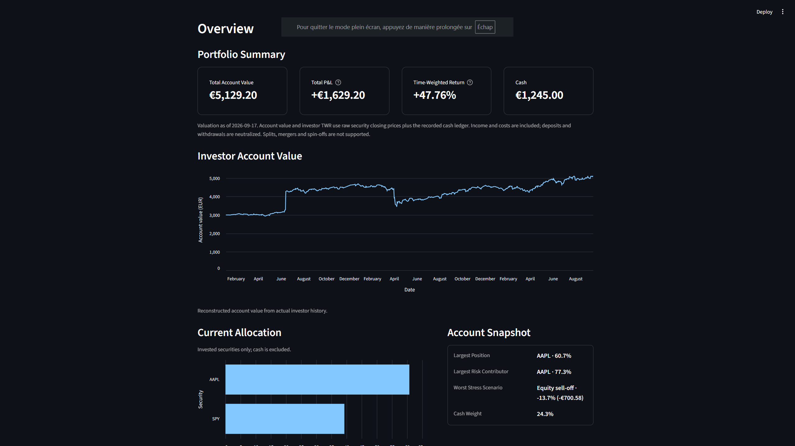
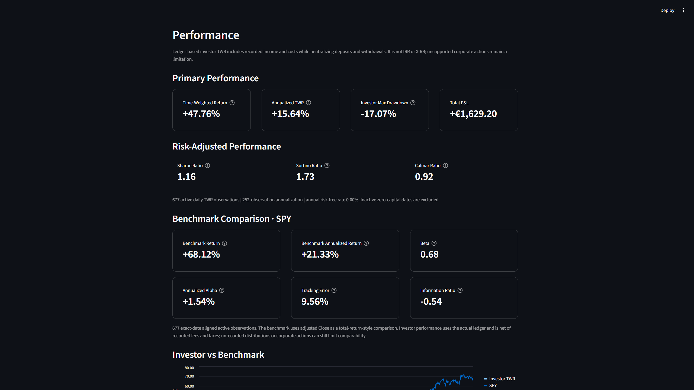
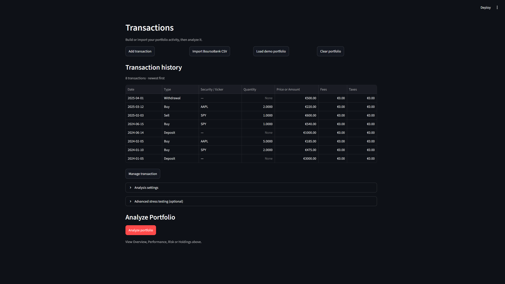

# Portfolio Risk Analytics

Portfolio Risk Analytics is a Python and Streamlit application that reconstructs actual investor performance from a transaction ledger and separately analyses the risk of the current portfolio allocation. It is an educational quantitative-finance project focused on transparent portfolio accounting, performance measurement and market-risk analysis.

## Overview

The investor-performance workflow reconstructs changing historical holdings and cash from the actual transaction ledger. Deposits, withdrawals, dividends, interest, fees and taxes are incorporated into the account history, which is used to calculate time-weighted returns and accounting P&L.

Current-allocation risk is a separate analysis. It applies today's security weights, and optionally the current cash balance, to historical return data; it does not represent the investor's actual historical portfolio path.

## Main features

- Unified ledger for `BUY`, `SELL`, `DEPOSIT`, `WITHDRAWAL`, `DIVIDEND`, `INTEREST`, `FEE` and `TAX` events, with BoursoBank PEA CSV import.
- Daily cash and holdings reconstruction, cash-flow-neutral time-weighted return (TWR), and realized and unrealized market P&L.
- Economic total P&L including portfolio income, fees and taxes.
- Annualized return, volatility, drawdown, Sharpe, Sortino and Calmar ratios.
- Historical VaR, Expected Shortfall, EWMA volatility and EWMA VaR, with VaR backtesting and model validation.
- Separate Account Risk and Invested Securities risk views.
- Component risk contributions, concentration and diversification diagnostics.
- Benchmark beta, Jensen alpha, tracking error and information ratio.
- Optional user-defined stress testing.

## Screenshots







## Methodology

- Raw `Close` prices are used for current and historical security valuation. Adjusted return-price series are used for risk analytics.
- Investor TWR is calculated from the actual reconstructed ledger and changing historical holdings.
- `DEPOSIT` and `WITHDRAWAL` are external cash flows and are neutralized by TWR. `DIVIDEND` and `INTEREST` are internal portfolio income; fees and taxes reduce economic performance.
- Current-allocation historical risk holds today's weights constant through the selected risk window, equivalent to daily rebalancing.
- Account Risk includes current cash with zero assumed return and risk. Invested Securities risk excludes cash.
- Benchmark analytics use an adjusted return series aligned with valid investor TWR observations.
- Returns and volatility measures are annualized using 252 trading days.
- Stress testing is optional and applies user-defined security shocks to the current allocation.

## Project structure

```text
app.py                  Streamlit application
risk_analysis.py        File-based risk-analysis workflow
src/                    Accounting, performance and risk calculations
  importers/            Broker-data importers
tests/                  Automated tests
inputs/                 Example ledgers and stress scenarios
docs/screenshots/       Application screenshots
```

## Running locally

```bash
python -m venv .venv
pip install -r requirements.txt
streamlit run app.py
pytest -q
```

Live analysis requires internet access to retrieve market data. The repository includes a broad automated test suite for the accounting, performance and risk calculations.

## Limitations

- The application supports one display and accounting currency at a time and does not perform foreign-exchange conversion.
- Corporate actions such as splits, mergers and spin-offs are not fully modelled.
- Market-data availability and revisions depend on Yahoo Finance through `yfinance`.
- The BoursoBank importer uses explicit ISIN-to-market-ticker mappings where required.
- Investor-performance accuracy depends on the completeness and accuracy of the recorded ledger.
- This is an educational portfolio analytics project, not investment advice or production accounting software.
